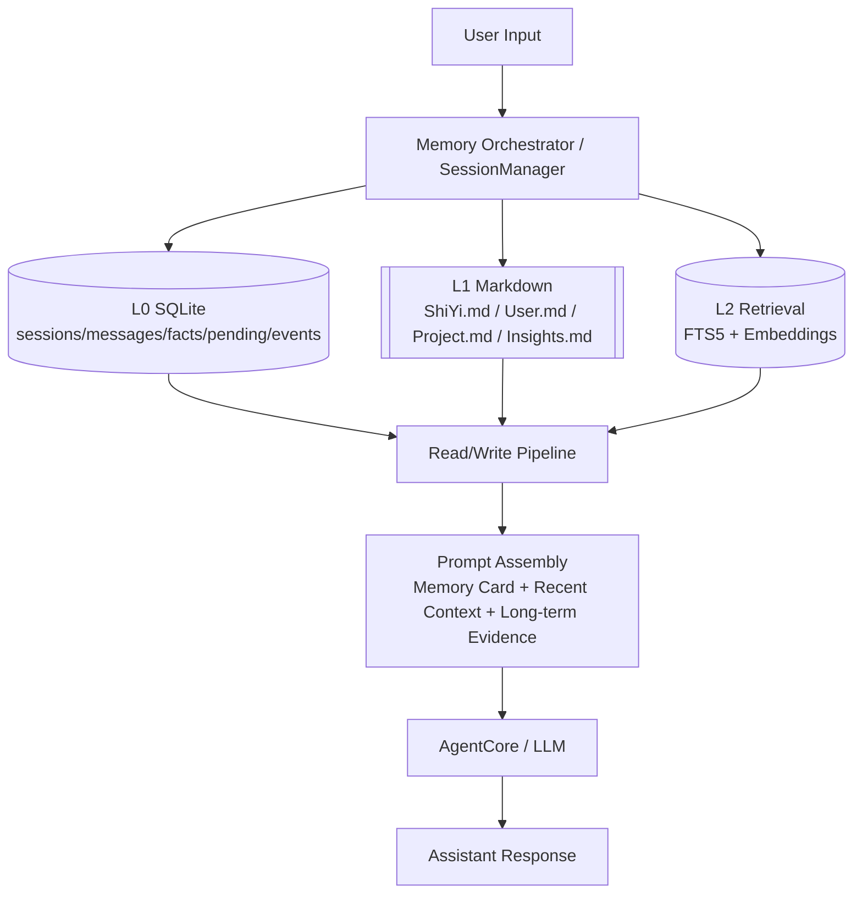
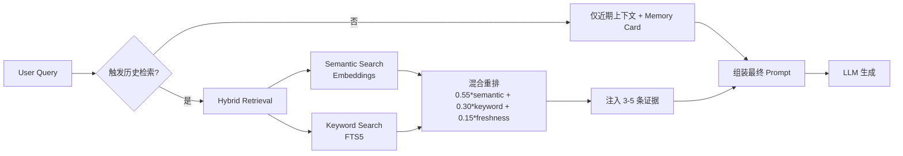
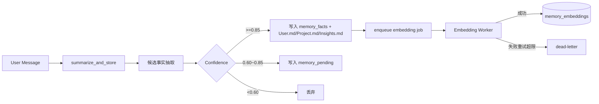

# Shiyi — 私人定制智能助手

> 懂你的助手，部署在你自己的主机上。

Shiyi 是一个私人定制的中文智能助手，支持**语音**、**CLI**、**HTTP API** 三通道并行运行，具备工具调用、子 Agent 协作和多会话持久化能力。可部署于任意主机（Linux / macOS / Windows），语音功能可选。

---

## 功能特性

### 三通道并行

| 通道 | 说明 | 配置开关 |
|------|------|---------|
| TUI | 基于 Textual 的终端界面，Markdown 渲染、工具调用折叠块、Token 统计 | `channels.cli.enabled: true` |
| CLI | 原始终端文字交互（`--no-tui` 回退） | `channels.cli.enabled: true` |
| API | FastAPI HTTP 服务，JSONL 流式响应 | `channels.api.enabled: true` |
| 语音 | 唤醒词 → VAD 录音 → STT → LLM → TTS | `channels.voice.enabled: true` |

### 工具调用

LLM 可主动调用内置工具：

| 工具 | 功能 |
|------|------|
| `search_web` | DuckDuckGo 搜索，无需 API 密钥 |
| `file_operations` | 文件读写（read / write / append / list）|
| `execute_shell` | Shell 命令执行（含安全黑名单）|
| MCP 工具 | 可接入任意外部 MCP 协议工具服务器 |

### 子 Agent 系统

主 Agent 可将任务委派给专业子 Agent：

- **code_assistant** — 代码编写、调试、执行（temperature=0.3）
- **general_qa** — 知识问答、分析推理（temperature=0.7）

工具与 Agent 均支持自动发现，放入对应目录即可生效，无需手动注册。

### 会话记忆

- 三层记忆漏斗：L0（SQLite 原始层）+ L1（Markdown 认知层）+ L2（FTS5 + 向量检索层）
- 全局唯一用户画像（所有会话共享 `User.md`）
- 首次身份引导（确认十一人设 + 用户身份后不重复询问）
- 置信度写入分流：高置信自动写入，中置信进入待确认队列
- 记忆代谢：`Project.md` 滚动总结、`Insights.md` 热点池（Top-N）
- 异步 embedding 队列（重试 + dead-letter）与检索降级链路

---

## 记忆系统架构（Memory V2）

### 架构设计图



### 读取流程图（常驻近期 + 按需长期检索）



### 写入流程图（置信度分流 + 代谢）



---

## 快速开始

### 环境要求

- Python 3.10+
- [uv](https://github.com/astral-sh/uv) 包管理工具

```bash
# 安装 uv（如未安装）
curl -LsSf https://astral.sh/uv/install.sh | sh   # Linux / macOS
powershell -c "irm https://astral.sh/uv/install.ps1 | iex"  # Windows
```

### 安装

```bash
git clone https://github.com/your-username/shiyi.git
cd shiyi

uv venv
source .venv/bin/activate   # Linux / macOS
.venv\Scripts\activate      # Windows

uv pip install -e .
```

### 配置

```bash
cp .env.example .env
```

编辑 `.env`，至少填入 LLM 密钥：

```env
# 必填
DEEPSEEK_API_KEY=your_key_here

# 仅语音通道需要（腾讯云一句话识别）
TENCENT_APP_ID=your_app_id
TENCENT_SECRET_ID=your_secret_id
TENCENT_SECRET_KEY=your_secret_key
```

### 启动

```bash
shiyi              # 启动 TUI 界面（默认）
shiyi --debug      # TUI + 底部实时日志面板
shiyi --no-tui     # 回退到原始 CLI 模式
python main.py     # 等同于 shiyi
```

默认启动 TUI 通道。如需同时开启 API 或语音通道，编辑 `config/config.yaml`：

```yaml
channels:
  cli:
    enabled: true
  api:
    enabled: true   # 同时启动 FastAPI，监听 :8000
  voice:
    enabled: false  # 需要麦克风硬件
```

---

## 使用说明

### TUI 界面

```
┌─────────────────────────────────────────────┐
│  ✦ ShiYi            DeepSeek-V3 │ a1b2c3 │ ●│  Header
├─────────────────────────────────────────────┤
│  👤 你                                      │
│  帮我搜索一下今天的天气                        │
│                                             │
│  ⚡ search_web("今天北京天气")        [折叠]   │
│                                             │
│  ✦ 十一                                     │
│  今天北京天气晴，气温 **25°C**...             │
├─────────────────────────────────────────────┤
│ Tokens: 1.2k/128k ████░░░░ 0.9% │ 消息: 3  │  Footer
├─────────────────────────────────────────────┤
│ > 输入消息... (/help 查看命令)                │
└─────────────────────────────────────────────┘
```

**斜杠命令：**

| 命令 | 功能 |
|------|------|
| `/new` | 创建新会话 |
| `/list` | 列出所有会话 |
| `/switch <id>` | 切换到指定会话 |
| `/clear` | 清屏 |
| `/help` | 显示帮助 |

**快捷键：** `Ctrl+C` 中断/退出 · `Ctrl+D` 退出 · `Ctrl+L` 清屏

### API 通道

启用后默认监听 `http://0.0.0.0:8000`，Swagger 文档见 `/docs`。

**端点列表：**

```
POST   /api/chat              非流式对话
POST   /api/chat/stream       流式对话（JSONL）
GET    /api/sessions          列出所有会话
POST   /api/sessions          创建新会话
DELETE /api/sessions/{id}     删除会话
GET    /api/memory/user       全局用户记忆状态
POST   /api/memory/onboarding 首次身份引导确认
GET    /api/memory/pending    待确认记忆列表
POST   /api/memory/pending/{id} 更新待确认记忆状态
GET    /api/memory/facts      结构化记忆事实
GET    /api/memory/events     记忆事件流水
GET    /api/memory/search     记忆检索（hybrid/keyword）
GET    /api/memory/metrics    记忆观测指标
GET    /api/memory/embedding-jobs     embedding 队列状态
POST   /api/memory/embedding-jobs/run 手动触发 embedding worker
GET    /health                健康检查
```

**流式响应格式（JSONL）：**

```json
{"type": "session", "session_id": "xxx"}
{"type": "text", "content": "你好"}
{"type": "tool_call", "tool": "search_web", "args": {"query": "..."}}
{"type": "tool_result", "tool": "search_web", "result": "..."}
{"type": "done"}
```

**示例请求：**

```bash
curl -X POST http://localhost:8000/api/chat/stream \
  -H "Content-Type: application/json" \
  -d '{"message": "帮我写一个 Python 冒泡排序"}'
```

---

## 部署

### 普通主机（常驻后台）

```bash
# 使用 systemd（Linux）
sudo tee /etc/systemd/system/shiyi.service <<EOF
[Unit]
Description=Shiyi Assistant
After=network.target

[Service]
WorkingDirectory=/opt/shiyi
ExecStart=/opt/shiyi/.venv/bin/shiyi
Restart=on-failure
EnvironmentFile=/opt/shiyi/.env

[Install]
WantedBy=multi-user.target
EOF

sudo systemctl enable --now shiyi
sudo journalctl -u shiyi -f   # 查看日志
```

### Docker

```dockerfile
FROM python:3.11-slim
WORKDIR /app
COPY . .
RUN pip install uv && uv pip install -e . --system
CMD ["shiyi"]
```

```bash
docker build -t shiyi .
docker run -d --env-file .env -p 8000:8000 shiyi
```

### 仅启用 API + CLI（无语音依赖）

如果不需要语音功能，可裁剪依赖：确保 `config.yaml` 中 `channels.voice.enabled: false`，无需安装 PyAudio / torch 等重型依赖。

> 注意：`pyproject.toml` 目前包含完整依赖。如需轻量部署，可手动跳过 pyaudio / torch / torchaudio 的安装。

---

## 配置说明

主配置文件：`config/config.yaml`

```yaml
system:
  name: "Shiyi"
  log_level: "INFO"   # DEBUG 可查看详细日志

channels:
  cli:    {enabled: true}
  api:    {enabled: false, host: "0.0.0.0", port: 8000}
  voice:  {enabled: false}

llm:
  api_base: "https://api.deepseek.com/v1"
  model: "deepseek-chat"
  system_prompt: |
    你是"Shiyi"，主人的私人智能助理。...

agent:
  enable_sub_agents: true
  max_context_tokens: 4000

tools:
  builtin: [file_operations, execute_shell, search_web]
  mcp:
    enabled: false
    servers: []   # 接入外部 MCP 服务器

memory:
  sqlite_path: "data/sessions.db"
  memory_root: "data/memory"
  cache_size: 100
  auto_flush_interval: 60
  embedding_dimension: 128
  embedding_retry_limit: 3
  embedding_retry_base_seconds: 10
  embedding_poll_interval: 5
```

---

## 扩展

### 添加自定义工具

在 `tools/builtin/` 下新建文件，实现 `Tool` 类并提供 `definition` 属性，`ToolRegistry` 会自动发现并注册。

### 添加自定义子 Agent

在 `agents/builtin/` 下新建文件，继承 `BaseAgent`，`AgentRegistry` 自动发现。

---

## 技术栈

| 模块 | 技术 |
|------|------|
| LLM | DeepSeek（OpenAI 兼容接口，可替换） |
| Web 框架 | FastAPI + JSONL 流式响应 |
| 数据库 | SQLite + SQLAlchemy async + FTS5 |
| 记忆检索 | Hybrid Retrieval（FTS5 + Embedding） |
| 缓存 | LRU 内存缓存 |
| TUI | Textual + Rich（终端界面）|
| 搜索 | DuckDuckGo（ddgs，无需 API Key）|
| MCP | httpx 异步 HTTP 客户端 |
| 唤醒词 | openWakeWord（本地，可选）|
| VAD | Silero VAD（可选）|
| STT | 腾讯云一句话识别（可选）|
| TTS | Microsoft Edge-TTS（可选）|
| 包管理 | uv |

---

## 致谢

- [openWakeWord](https://github.com/dscripka/openWakeWord)
- [Silero VAD](https://github.com/snakers4/silero-vad)
- [Edge-TTS](https://github.com/rany2/edge-tts)
- [ddgs](https://github.com/deedy5/ddgs)
- [uv](https://github.com/astral-sh/uv)

---

MIT License
