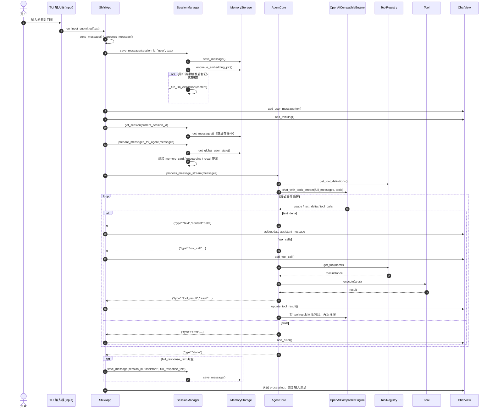
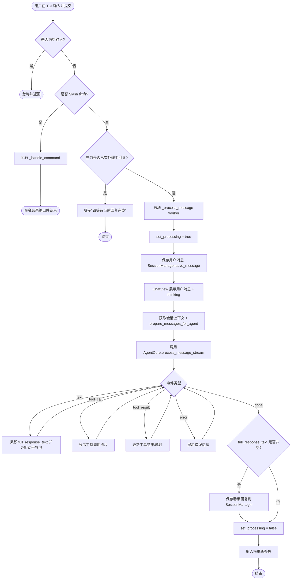

# TUI 提问到答案输出：时序图与流程图

本文梳理从用户在 TUI 提交问题，到最终在界面看到答案并落库的核心链路。

## 时序图（Sequence Diagram）

## 流程图（Flowchart）

## 关键代码入口

- `channels/tui/app.py`：`on_input_submitted`、`_process_message`
- `core/session_manager.py`：`save_message`、`prepare_messages_for_agent`
- `core/agent_core.py`：`process_message_stream`
- `engines/llm/openai_compatible_engine.py`：`chat_with_tools_stream`
